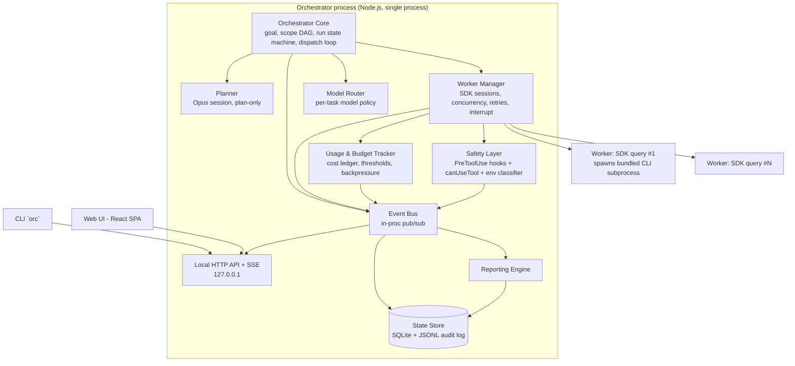
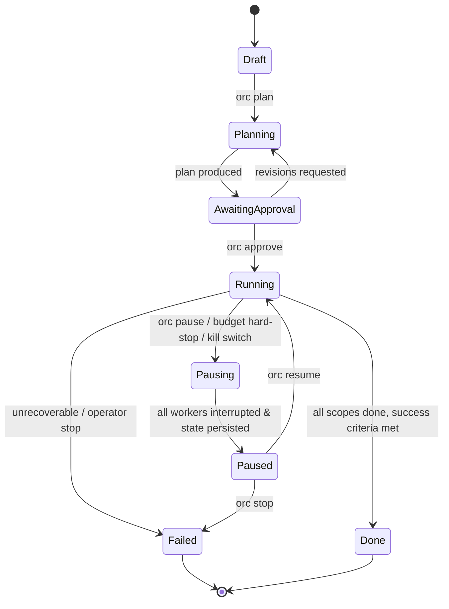

# Local Project Orchestrator ("the Orchestrator") — Technical Specification

**Status:** DRAFT — awaiting approval. No implementation until sign-off.
**Date:** 2026-07-07
**Verification note:** SDK/CLI claims below were checked against current Agent SDK and Claude Code docs (code.claude.com, platform.claude.com) on this date. Items that could not be verified are marked ⚠️ UNVERIFIED and repeated in §14.

---

## 1. Overview & goals

A local, single-machine desktop application that acts as an orchestration brain: you define a goal with well-defined scopes; it plans a decomposition for your approval, then spawns and coordinates Claude Code sub-agent sessions to execute, streaming everything to a localhost web UI and a CLI. It draws exclusively from your Claude Max 20x subscription via the Claude Code CLI's subscription login, tracks estimated usage against a configurable budget, and enforces — as a first-class guarantee — that no subagent can ever perform a destructive operation against a production target.

Design goals, in priority order:

1. **Bounded blast radius.** Every agent action passes through a deny-first safety layer that holds even under permissive permission modes.
2. **Observability.** Every lifecycle event and tool call is streamed live and persisted to an append-only audit log. If it isn't observable, it didn't happen safely.
3. **Autonomy under constraint.** The Orchestrator picks steps, models, and parallelism inside boundaries you approved; it never widens a boundary on its own.
4. **Recoverability.** Crash, pause, or kill at any moment → resume from persisted state with no lost work beyond the interrupted turn.
5. **Solo-operable.** One process (plus CLI worker subprocesses), one SQLite file, one browser tab. No infra to babysit.

## 2. Non-goals / explicit constraints

- **No cloud.** No VPS, relay, remote workers, telemetry, or multi-tenant anything. Web UI binds to `127.0.0.1` only.
- **No API-key billing.** `ANTHROPIC_API_KEY` must never be set in the Orchestrator's or any worker's environment. That variable overrides subscription auth and switches billing to pay-as-you-go API. The worker spawn path **strips** it (and `ANTHROPIC_AUTH_TOKEN`, `CLAUDE_CODE_USE_BEDROCK`, `CLAUDE_CODE_USE_VERTEX`) from the child environment and refuses to start if subscription login is absent (preflight: run a trivial `claude -p` and verify it succeeds without an API key; surface `/status`-equivalent info at startup).
- **Single user, no auth product.** No login system, no sharing of claude.ai limits with anyone else (prohibited by Anthropic policy). Localhost binding is the access control; an optional random bearer token on the local API is a hardening step, not a user-auth feature.
- **Not a distributed system.** No queues/brokers/k8s. Concurrency is an in-process scheduler over child sessions.
- **Never destructive in production** (§8). Not configurable off.
- **Spec before code.** This document is the only deliverable of this phase.

## 3. Architecture



### Component responsibilities & interfaces

**Orchestrator Core.** Owns the Goal, the Scope DAG, and the Run state machine (§5). Runs the dispatch loop: on each tick, take ready Tasks (dependencies met, scope approved, budget available, concurrency slot free), consult the Model Router, hand a fully-specified TaskSpec to the Worker Manager. Consumes worker lifecycle events to advance the DAG. Interface: in-proc methods invoked by the API layer (`createGoal`, `startPlanning`, `approvePlan`, `start/pause/resume/stop`, `adjustBudget`).

**Planner.** A dedicated SDK session pinned to Opus, `permissionMode: "plan"`, tools restricted to read-only (`Read`, `Glob`, `Grep`) — it may inspect the repo to plan but cannot edit or run Bash. Input: Goal + repo context. Output: structured Scope/Task breakdown via `outputFormat: { type: "json_schema", schema: PlanSchema }`, validated against the data model, then presented for human approval. The Planner never executes and never dispatches.

**Worker Manager.** One worker = one Agent SDK `query()` call = one child Claude Code CLI subprocess (the TS SDK bundles the binary). Each worker gets exactly the scope's config: `cwd`, `allowedTools`/`disallowedTools`, `permissionMode`, `model`, `maxTurns`, `maxBudgetUsd`, SDK `hooks`, `canUseTool`. Responsibilities: spawn, stream messages onto the bus, capture `session_id` from the init message (for resume), enforce concurrency limit, retry policy (§13), `interrupt()` on pause/stop, kill on hard abort. **Design choice — flagged as Open Decision 4:** the Orchestrator does its own fan-out with independent top-level sessions per task, rather than one mega-session using the Task tool to spawn SDK subagents. Rationale: per-task model/permission/cwd control, per-task `session_id` for pause/resume, per-task cost attribution from result messages, and no shared conversation-context pollution. SDK subagents remain available *within* a worker for small parallel sub-steps (they cannot nest further — one level only, confirmed). The TS SDK's Workflow tool (orchestration outside conversation context, `MAX_CONCURRENT`/`MAX_TOTAL_SUBTASKS`) exists and was verified, but it targets dozens-to-hundreds of coordinated agents; at this project's scale (≤4 concurrent workers on one Max plan) it adds indirection without benefit. Revisit if scale changes.

**Model Router.** Pure function `(task, scope, config) → { model, reason }`. §6.

**Usage & Budget Tracker.** Ledger of every result message's `total_cost_usd`; enforces thresholds; detects rate-limit signals and applies backpressure. §7.

**Safety Layer.** Environment classifier + `PreToolUse` hook + `canUseTool` callback + mode floor. §8. Registered on *every* worker unconditionally — workers cannot be constructed without it (constructor-injected, not opt-in).

**Event Bus & State Store.** In-process typed pub/sub (`EventEmitter`-style, but every event is also synchronously appended to the store *before* fan-out, so the persisted log is never behind the UI). Store = SQLite (entities, indexes, resumable state) + append-only JSONL audit log (every tool call, every block, every hook decision; one file per run; never rewritten). Crash recovery = reload SQLite + replay tail of JSONL if needed.

**Local HTTP API.** REST for commands, SSE for the event stream. Serves the SPA. Binds `127.0.0.1` only.

**CLI (`orc`).** Thin client over the same HTTP API — everything the UI can do (§9). Also works when the server is down for `orc serve` and `orc doctor`.

**Reporting Engine.** Subscribes to the bus; emits reports on interval and milestones to UI, CLI, and Markdown files. §11.

## 4. Data model

All entities carry `id` (ULID), `created_at`, `updated_at`. Stored in SQLite; enums as TEXT.

**Goal**
| field | type | notes |
|---|---|---|
| title | text | |
| objective | text | what "done" means, in prose |
| success_criteria | json[] | checkable statements; each `{description, verification_method}` |
| constraints | json[] | hard rules the plan must honor |
| out_of_scope | json[] | explicit exclusions |
| repo_root | path | project root |
| status | enum | draft, planning, awaiting_approval, active, done, abandoned |

**Scope** (bounded region of work; unit of safety config)
| field | type | notes |
|---|---|---|
| goal_id | fk | |
| name, description | text | |
| path_allowlist | glob[] | dirs/files the scope may touch (enforced, §8) |
| path_denylist | glob[] | overrides allowlist |
| allowed_tools / disallowed_tools | text[] | maps to SDK options |
| model_tier | enum | haiku, sonnet, opus, auto (router decides) |
| environment | enum | development, staging, **production**, **unknown** — unknown is treated as production |
| permission_mode | enum | plan, default, acceptEdits — bypassPermissions is not representable in this field |
| forbidden_actions | json[] | human-readable + machine patterns appended to deny rules |
| success_criteria | json[] | |
| max_budget_usd | number | scope-level ceiling |
| status | enum | proposed, approved, running, blocked, done, failed |
| depends_on | fk[] | scope-level DAG edges |

**Task** (atomic dispatchable unit inside a scope)
| field | type | notes |
|---|---|---|
| scope_id | fk | inherits all scope boundaries |
| title, prompt | text | worker system+user prompt material |
| task_type | enum | mechanical, codegen, refactor, test, review, planning, research — router input |
| depends_on | fk[] | task-level DAG |
| status | enum | pending, queued, running, paused, blocked, done, failed, skipped, cancelled |
| attempt | int | retry counter |
| model_used | text | filled at dispatch |
| routing_reason | text | router explanation, logged |
| session_id | text | from init message; key to resume |
| cost_usd | number | sum of result messages for this task |
| result_summary | json | structured output from worker |
| error | json | last failure detail |

**SubagentRecord** (a live/finished worker session; 1:1 with Task attempt)
`task_id, session_id, model, pid, state (spawning/running/interrupting/paused/exited), started_at, ended_at, num_turns, cost_usd, last_tool_call (json), transcript_path`

**Run** (one execution of a goal)
`goal_id, state (§5), budget_usd, budget_spent_usd, budget_state (ok/warn/stopped), concurrency_limit, started_at, paused_at, finished_at, pause_reason`

**Report**
`run_id, trigger (interval/scope_done/task_done/budget_threshold/manual/final), content_md, path, created_at`

**BudgetLedgerEntry**
`run_id, task_id, session_id, cost_usd, num_turns, model, tokens_in, tokens_out, cache_read, cache_write, recorded_at` — one row per result message, the source of truth for aggregation.

**AuditEvent** (JSONL, append-only; not in SQLite)
`ts, run_id, task_id, session_id, kind (tool_call/tool_result/hook_block/permission_deny/interrupt/dispatch/state_change), tool_name, tool_input_hash, tool_input (redacted per §8.6), decision, rule_id, detail`

## 5. Execution lifecycle & state machine

### Run state machine



Task states: `pending → queued → running → {done | failed | paused | blocked}`; `failed → queued` (retry, bounded); `blocked` requires operator action (§8.5).

### Pause / resume / interrupt semantics

- **Pause (graceful, default).** (a) Dispatch loop halts immediately — no new tasks queued. (b) Each running worker gets `interrupt()` (TS SDK `Query.interrupt()`, confirmed), which stops at the next message boundary — effectively the next tool-call boundary; the CLI finishes the in-flight tool call, then yields. (c) Worker Manager records `session_id`, final streamed state, and marks the task `paused`. (d) Run enters `Paused` only after every worker has exited or a 60s grace timeout elapses, after which stragglers are SIGTERM'd (then SIGKILL after 10s) and their tasks marked `paused` with `dirty=true` (resume will re-verify workspace state first).
- **Resume.** For each `paused` task: new `query()` with `resume: session_id` and a short continuation prompt ("You were interrupted; verify workspace state, then continue."). Same scope config re-applied — resume never inherits stale permissions from the old process; config is re-derived from the Scope row. `forkSession: true` is used only for explicit "branch and try another approach" operator action, never for plain resume.
- **Hard abort (kill switch).** SIGKILL all workers immediately, mark tasks `paused/dirty`, run → `Paused`. Available from UI, CLI (`orc panic`), and as an OS signal handler on the orchestrator process.
- **Crash recovery.** On startup, any Run in `Running/Pausing` is demoted to `Paused`; orphaned CLI subprocesses are detected via recorded PIDs and killed. Nothing auto-resumes without operator command. ASSUMPTION (Open Decision 8): no auto-resume after crash — conservative default.

### Dispatch loop (Running state)

Every tick (event-driven, plus 5s heartbeat): ready tasks = dependencies satisfied ∧ scope approved ∧ `budget_state ≠ stopped` ∧ backpressure clear ∧ slots free. For each: route model → build worker config → verify safety layer attached (assert, not check) → spawn → emit `dispatch` event.

## 6. Model routing policy

Deterministic, rule-based, configured in `orchestrator.toml`, hot-reloadable. No LLM in the routing decision itself (the Planner already labeled each task with `task_type`; routing must be cheap, explainable, reproducible).

Default policy (each rule logs `routing_reason`):

| rule | condition | model |
|---|---|---|
| R1 | scope.model_tier ≠ auto | that tier (scope pin wins) |
| R2 | task_type ∈ {planning, research, review} of architecture-level artifacts | opus |
| R3 | task_type ∈ {codegen, refactor, test} | sonnet |
| R4 | task_type = mechanical (renames, formatting, file moves, bulk find/replace, doc stubs) | haiku |
| R5 | escalation: task failed ≥2 attempts on current model | bump one tier (haiku→sonnet→opus), log `escalated_from` |
| R6 | budget pressure: `budget_state = warn` | cap new dispatches at sonnet unless R1 pins opus |
| R7 | rate-limit pressure on a specific model (e.g. "Opus limit" signal) | route around it: opus→sonnet with `degraded=true` flag, surfaced in UI/report |

Applied via per-agent/per-query `model` option (values `"haiku" | "sonnet" | "opus" | "inherit"`, confirmed in both SDKs). Every decision emits a `routing_decision` audit event: task, rule fired, inputs, chosen model. The UI shows the model badge + reason on each subagent card.

## 7. Usage & budget tracking — design and honest limits

**The honest part first.** There is **no first-party API that returns "% of your Max 20x pool consumed"** (verified: not in current docs). The CLI's `/usage` and `/status` show plan usage interactively, but there is no confirmed programmatic endpoint. Additionally, under subscription auth, `total_cost_usd` is an **estimated USD-equivalent** of what the work *would* cost at API prices — you are not actually billed it. So the tracker is an *estimator plus a backpressure system*, not a meter. It gives: (a) relative consumption per run/scope/task, (b) a spend-equivalent ceiling you control, and (c) graceful reaction to the real signal — rate-limit errors from the CLI.

Mechanics:

1. **Per-result ledger.** Every SDK result message carries `total_cost_usd`, `num_turns`, and `usage` (token counts incl. cache reads/writes) — confirmed. One `BudgetLedgerEntry` per result; aggregation is `SUM()` over the ledger, per task/scope/run/day.
2. **Per-query hard bound.** Every worker is launched with `maxBudgetUsd` (per-task ceiling from scope config; result subtype `error_max_budget_usd` on breach — confirmed) and `maxTurns` to bound runaway loops. ⚠️ The TS option name `maxBudgetUsd` was inferred from the Python `max_budget_usd`; confirm exact TS name against the TS reference before implementation.
3. **Run thresholds.** Configurable: `warn_at` (default 70%) → banner in UI/CLI + report + router rule R6; `hard_stop_at` (default 90%) → dispatch halts (`budget_state=stopped`), in-flight workers allowed to finish their current task (they're individually bounded), run auto-pauses at 100%. Defaults are Open Decision 6.
4. **Rate-limit backpressure.** The CLI surfaces limits as human-readable errors ("You've hit your session limit · resets 3:45pm", "…weekly limit…", "…Opus limit") — confirmed text, ⚠️ no confirmed structured error code. Detection is therefore pattern-matching on error text, isolated in one `limitSignals.ts` module with the patterns in config (they will change; when no pattern matches but the worker failed with a 429-ish shape, treat as `unknown_limit` and back off anyway — conservative). Response: parse the reset time if present; pause dispatch until then (exponential backoff with jitter when unparseable: 1m → 2m → 4m → cap 30m); per-model limits only quarantine that model (router R7); surface a countdown in UI/CLI.
5. **`/status` surfacing.** `orc doctor` and the UI settings page run a lightweight check of CLI auth/plan state and display what the CLI reports. Best-effort; not used for enforcement.
6. **Run-count budgeting.** Secondary ceiling: max tasks dispatched per run and per hour, since subscription limits correlate with volume, not USD.

## 8. Safety model — "never destructive in production"

Defense in depth; each layer independently sufficient to stop the canonical accident (`rm -rf` in the wrong directory, force-push to main, `DROP TABLE` against a prod connection string).

### 8.1 Production detection (conservative classifier)

A scope's `environment` is set explicitly in the plan (operator-reviewed). Independently, the classifier re-evaluates continuously and can only *raise* severity, never lower it. Signals → production:

- git branch of the scope's cwd ∈ {`main`, `master`, `prod`, `production`, `release/*`} **at dispatch time and re-checked on every Bash `PreToolUse`** (a subagent may `git checkout main` mid-task);
- presence of `.env.production`, `*.prod.*` config, k8s/terraform prod contexts in the path allowlist;
- any tool input referencing a host/URL/connection string matching a configurable prod indicator list (default: anything not `localhost`/`127.0.0.1`/`*.local`/private RFC-1918 ranges is *unknown*);
- explicit operator flag.

**Ambiguity rule:** `unknown` ⇒ treated as `production`. Downgrading to `development` requires explicit operator action, recorded in the audit log.

### 8.2 Destructive-command interception (PreToolUse hook)

SDK-defined `PreToolUse` hooks run before the rest of the permission chain and apply to subagent tool calls too (both confirmed) — so the guarantee holds even under `acceptEdits`, and even for tools a mode would auto-approve. The hook denies via `hookSpecificOutput: { permissionDecision: "deny" }` (confirmed shape).

Evaluation pipeline for `Bash` inputs: parse with a real shell parser (tree-sitter-bash or `shell-quote`) — **not regex-only** — to unwrap `sh -c "…"`, `xargs`, command substitution, `&&` chains, aliases like `$(which rm)`; then match each resolved command against rule classes. Regex remains as a backstop for unparseable input (unparseable ⇒ deny in production scopes).

Rule classes (deny in production-flagged scopes; in dev scopes: allow-with-audit or require-approval per class, configurable):

| class | examples |
|---|---|
| filesystem destruction | `rm -rf` / `-fr`, `find … -delete`, `shred`, `mkfs`, `dd of=/dev/*`, writes outside `path_allowlist` |
| VCS destruction | `git push --force`/`+ref`, `git push --delete`, `git reset --hard @{u}`, `git clean -fdx` outside allowlist, branch deletion of protected branches, `git filter-repo` |
| database destruction | `DROP`, `TRUNCATE`, `DELETE`/`UPDATE` without `WHERE`, destructive migrations — matched in `psql/mysql/sqlite3/mongo/redis-cli` invocations and in SQL passed via any MCP db tool |
| infra teardown | `terraform destroy/apply`, `kubectl delete`, `docker system prune`, `aws|gcloud|az` mutating verbs, `helm uninstall` |
| publish/deploy | `npm publish`, `cargo publish`, `gh release`, `docker push`, deploy CLIs (`vercel --prod`, `flyctl deploy`, …) |
| credential access | reads of `~/.ssh`, `~/.aws/credentials`, keychain CLIs, `.env*` outside scope allowlist; also blocks `Read` tool on these paths |
| network exfil/danger | `curl|wget … \| sh`, POSTing files from credential paths |

The same interception applies to non-Bash tools: `Write`/`Edit` are checked against `path_allowlist`/`path_denylist`; MCP tools are classified by an allowlist (unknown MCP tool in a production scope ⇒ deny).

### 8.3 Mode floor & permission chain

- Production scopes: `permissionMode` pinned to `plan` (read-only) or `default` with human approval per privileged call; `acceptEdits` requires an explicit signed-off exception; **`bypassPermissions` is unrepresentable** — the Scope type doesn't include it, the worker builder throws if it ever sees it, and a `PermissionRequest`-time assertion double-checks.
- Second layer: `canUseTool` callback (runtime, per-call — confirmed: returns `behavior: "allow"|"deny"`, optional `updatedInput`) implements path-allowlist checks and can rewrite inputs (e.g., force `--dry-run` onto a deploy command in staging). Hooks are the guarantee; `canUseTool` is policy refinement.
- Least privilege defaults: scopes get the minimal tool list the Planner justified; `WebSearch`/`WebFetch` off by default; MCP servers per-scope opt-in.

### 8.4 Workspace isolation

Each scope runs in a dedicated **git worktree** on a scope branch (`orc/<goal>/<scope>`), cwd pinned there. Merges to real branches happen only via an operator-reviewed step (or a PR the operator opens). This makes "production" mostly unreachable by construction — the guard rails of §8.1–8.3 then cover the residual paths (db connections, deploy CLIs, cloud APIs). ASSUMPTION (Open Decision 7): worktree-per-scope is acceptable for your repos.

### 8.5 Escalation path for blocked actions

When the hook denies: the tool call fails with an explanatory message injected back to the subagent ("blocked by production guard rule VCS-2; do not retry; propose an alternative or mark blocked"). The worker may continue with non-blocked work. On the **second** denial of the same rule in one task, the task transitions to `blocked`, the run keeps going elsewhere, and the operator gets a UI/CLI notification with: rule fired, exact input, subagent's stated intent, and three actions — *deny & instruct* (send guidance, unblock), *approve once* (single-use exemption executed under `default` mode with the operator watching), or *skip task*. Every denial and every exemption is an audit event. Default posture is halt-scope-and-ask, never log-and-skip (silent skips hide broken assumptions).

### 8.6 Kill switch & audit

Global abort per §5. Audit log: append-only JSONL, every tool call (name, input with secrets redacted via pattern scrubber, decision, rule id), every hook block, every permission decision, every interrupt/dispatch/state change. `orc audit tail -f` and a UI audit view read it. Log files are chmod 600.

## 9. CLI command surface (`orc`)

Thin client over the local HTTP API; `--json` on every command for scripting; exit codes: 0 ok, 1 error, 2 blocked/needs-approval.

```
orc serve [--port 4173]                    # start the orchestrator daemon + web UI
orc doctor                                 # verify CLI auth (subscription, no API key), versions, disk, git

orc goal new [-f goal.yaml | interactive]  # define objective, success criteria, constraints, out-of-scope
orc goal show <id> | orc goal list

orc plan <goal-id>                         # run Planner → scope/task breakdown
orc plan show <goal-id>                    # render proposed scopes, boundaries, models, budgets
orc plan edit <goal-id>                    # open plan YAML in $EDITOR, re-validate
orc approve <goal-id> [--scope <id>...]    # approve all or selected scopes

orc run start <goal-id> [--budget 25 --concurrency 3]
orc run pause|resume|stop <run-id>         # graceful; --now for hard abort
orc panic                                  # kill switch: SIGKILL everything, no questions

orc status [run-id] [--watch]              # run state, scopes, budget bar, active subagents
orc tail <task-id|subagent-id> [-f]        # live transcript of one subagent
orc tasks [--state running|blocked|failed]
orc blocked                                # pending escalations; orc blocked resolve <id> --approve-once|--deny --msg "..."

orc budget show <run-id>
orc budget set <run-id> --usd 40 [--warn 0.7 --stop 0.9]

orc report [run-id] [--now]                # latest report / force generation
orc audit tail [-f] [--rule <id>]
```

Examples: `orc goal new -f migrate-auth.yaml && orc plan $G && orc plan show $G && orc approve $G && orc run start $G --budget 30`.

## 10. Web UI spec

Localhost SPA served by the orchestrator. Screens:

**1. Run dashboard — the centerpiece (live flow view).**
- **Flow graph** (left, ~70%): DAG rendered goal → scopes → tasks/subagents. Nodes are live cards: state color (queued grey / running pulsing blue / blocked amber / done green / failed red / paused striped), model badge (H/S/O) with routing reason on hover, current tool call (e.g. `Bash: npm test`, truncated, ticking), cost so far, turns, elapsed. Edges show dependencies; completed paths dim. Environment badge on scope frames (`dev`/`prod` — prod frames get a red border always).
- **Timeline strip** (bottom): swimlane per worker slot showing task blocks over time — makes concurrency and rate-limit stalls visible.
- **Inspector** (right, on node click): streamed transcript (tool calls + text deltas), structured result when done, per-task ledger entries, audit events, resume/session id, buttons: tail, interrupt this task, retry, skip.
- **Header bar**: run state, global controls (⏸ pause, ▶ resume, ⏹ stop, 🔴 PANIC — double-confirm), budget bar (spent/warn/stop markers), backpressure indicator with reset countdown when rate-limited.
- **Blocked queue drawer**: escalations from §8.5 with the three-action resolution UI.

**2. Plan review screen.** Proposed scopes as expandable cards: boundary (path allowlist), tools, model tier, environment classification (with the signals that produced it), forbidden actions, budget. Approve per scope or all; request-changes sends a note back to the Planner session.

**3. Reports screen.** Report list + rendered Markdown; diff against previous report.

**4. Audit screen.** Filterable audit log (rule, task, decision); blocks highlighted.

**5. Settings.** Budget defaults, thresholds, concurrency, routing table editor, prod-indicator lists, deny-rule toggles (production rules are visible but not disableable), doctor/status panel.

**Real-time transport:** SSE (`text/event-stream`) for the event stream — server→client only is all the stream needs, auto-reconnect with `Last-Event-ID` gives seamless resume after laptop sleep; commands go over plain REST POSTs. WebSocket considered and rejected: bidirectionality unneeded, reconnection semantics worse out of the box. Event types mirror the bus: `task.state`, `tool.call`, `tool.result`, `text.delta` (from `includePartialMessages` streaming — confirmed in TS), `budget.tick`, `limit.backpressure`, `run.state`, `escalation.new`, `report.new`. UI virtualizes transcript rendering (text deltas at full rate to the open inspector only; other nodes get 2 Hz summaries).

## 11. Reporting design

Triggers: interval (default every 15 min while Running — Open Decision 10), milestones (scope completed, task failed, budget warn/stop crossed, run state change, escalation raised), manual (`orc report --now`), and final (run end).

Contents (Markdown, same body to all sinks): header (goal, run state, wall-clock, % tasks done); progress vs success criteria (Planner-produced checklist, checked off as scopes verify); tasks table done/running/pending/failed/blocked; budget: spent vs ceiling, burn rate, projected completion cost, rate-limit incidents; currently running subagents with current activity; blockers & escalations needing you; deviations (router escalations R5/R7, retries, dirty pauses); next planned dispatches.

Sinks: `reports/<run>/<timestamp>.md` (durable), UI reports screen (bus event), CLI (`orc report`), and the latest report is also written to `reports/<run>/latest.md` for easy tailing. Reports are generated from the store (not from an LLM) except the final report, which optionally uses one Haiku pass to write the executive summary — cheap, and flagged in the report as model-written.

## 12. Recommended tech stack

**Recommendation: TypeScript end-to-end, single Node process.**

| layer | choice | rationale | alternatives considered |
|---|---|---|---|
| language/runtime | Node 22 + TypeScript | The TS Agent SDK bundles the Claude Code binary (confirmed) — fewer moving parts; one language for core, hooks, CLI, and UI; `interrupt()` and `includePartialMessages` confirmed in TS but not confirmed in Python | Python SDK (fine, but UI/CLI would still want TS; two runtimes solo = drag); Rust core (unjustified complexity) |
| agent execution | `@anthropic-ai/claude-agent-sdk` in-process `query()` per worker | typed message stream, hooks/canUseTool in the same process as the safety layer (no IPC between guard and agent), session resume, per-query model/budget options | spawning `claude -p --output-format stream-json` subprocesses directly (good escape hatch, and used as fallback if an SDK gap appears; the SDK spawns the same CLI under the hood anyway) |
| HTTP/SSE server | Fastify (or Hono) | tiny, typed, SSE trivial | Express (fine, older ergonomics) |
| persistence | better-sqlite3 (WAL) + JSONL audit files | synchronous writes = trivially correct event ordering; one file to back up; zero infra | Postgres (overkill), JSONL-only (poor querying for UI) |
| UI | React + Vite; graph: **React Flow**; state over SSE | React Flow purpose-built for live node/edge dashboards | Svelte (fine; React Flow tips it), xterm.js only-terminal UI (insufficient for flow view) |
| CLI | commander + ink (for `--watch` views) | shares TS types with server | separate Go CLI (no) |
| packaging | plain `npm` project run via `orc serve`; **not** Electron/Tauri | it's a localhost daemon + browser tab; app-shell adds signing/update pain for zero benefit (Open Decision 9) | Tauri wrapper later if you want a dock icon |
| config | `orchestrator.toml` + per-goal YAML | human-diffable, hot-reload for routing/thresholds | JSON (less pleasant to hand-edit) |

Process model: 1 orchestrator process; N child CLI subprocesses (one per active worker, spawned by the SDK); the browser. Nothing else.

## 13. Risks, failure modes, mitigations

| # | risk | mitigation |
|---|---|---|
| 1 | Deny-rule bypass via shell creativity (encodings, `base64 \| sh`, custom scripts that delete things) | shell-parser (not regex) pipeline; unparseable ⇒ deny in prod; worktree isolation makes most damage non-prod by construction; `path_allowlist` enforced on Write/Edit independently; red-team test suite of bypass attempts in CI as a permanent fixture |
| 2 | Subagent edits files outside scope via Bash (`sed -i`, `mv`) rather than Edit tool | Bash rule class checks resolved file arguments against allowlist; worktree cwd limits reach; `git status` sweep post-task flags out-of-scope diffs and quarantines them |
| 3 | `ANTHROPIC_API_KEY` leaks into env (shell profile, direnv) → silent API billing | env stripped at spawn; `orc doctor` + startup preflight hard-fails if key detected; result messages sanity-checked (API-billed sessions can be detected by auth mode in init message where available — ⚠️ verify field) |
| 4 | Rate-limit text patterns change with CLI updates → backpressure blind | patterns in config, `unknown_limit` conservative fallback backs off on any repeated worker failure; CLI version pinned and upgraded deliberately |
| 5 | Cost estimates diverge from real subscription consumption | treat budget as relative control knob, not truth (§7); run-count ceilings as secondary bound |
| 6 | Interrupted task leaves half-applied edits | `dirty` flag on non-graceful stops; resume prompt mandates workspace verification; worktree diff shown to operator before resume of dirty tasks |
| 7 | Planner produces plausible-but-wrong decomposition | plan is inert until human approval; scopes carry verifiable success criteria; plan-edit loop |
| 8 | Context exhaustion in long tasks | `maxTurns` per task; Planner instructed to size tasks small; `PreCompact` hook logs compaction events so degraded context is visible |
| 9 | SQLite corruption / crash mid-write | WAL mode; audit JSONL is the recovery source; state re-derivable from events |
| 10 | Orchestrator bug dispatches despite `budget_state=stopped` | dispatch gate is a single choke-point function with an assertion + test; budget checks also enforced per-query via `maxBudgetUsd` regardless of orchestrator state |
| 11 | Two runs touching the same repo concurrently | lockfile per repo_root; second run refuses to start |
| 12 | Anthropic policy/product changes around programmatic subscription use | `orc doctor` surfaces CLI-reported plan state; design keeps the API-key path as a clean fallback switch (explicit, never silent) — revisit policy at build time ⚠️ |

## 14. Open decisions (need your call before implementation)

1. **Language confirmation:** TS end-to-end as recommended (§12), or do you want the Python SDK core for another reason?
2. **⚠️ Unverified items to accept or re-verify at build start:** exact TS name of the per-query budget option (`maxBudgetUsd` inferred); Python `interrupt()`/partial-message support (moot if TS); structured (non-text) rate-limit signal (none found — design assumes text parsing); whether the init message exposes auth mode (subscription vs API) for risk #3; current Anthropic policy language on programmatic subscription use for a personal tool.
3. **Concurrency default:** proposed 3 concurrent workers (Max 20x tolerates parallel sessions but shares the pool). Accept 3, or start at 2?
4. **Worker model:** independent top-level SDK session per task (recommended, §3) vs one coordinator session using SDK subagents. Accept recommendation?
5. **Dev-scope posture for destructive commands:** in non-prod scopes, should destructive classes be allow-with-audit (faster) or require-approval (safer)? Proposed default: require-approval for VCS/db/infra classes, allow-with-audit for filesystem-within-allowlist.
6. **Budget defaults:** warn 70% / hard-stop 90% / per-task `maxBudgetUsd` = scope budget ÷ task count (min $0.50, cap $5). Confirm numbers, and confirm USD-equivalent as the primary unit (vs run-count).
7. **Worktree-per-scope** (§8.4): acceptable for your repos? Any repos where worktrees break tooling?
8. **Crash behavior:** no auto-resume after crash (proposed). OK, or auto-resume clean (non-dirty) tasks?
9. **Packaging:** localhost daemon + browser tab (proposed), or do you want a Tauri/Electron shell from day one?
10. **Report interval:** 15 min while running. OK?
11. **Escalation default:** halt-scope-and-ask on second same-rule denial (proposed). OK, or halt on *first* denial in production scopes?
12. **Prod host indicators:** default treats any non-local/non-RFC-1918 host as `unknown`⇒production. Provide your real prod/staging host patterns to seed the config, or accept the strict default (more false-positive blocks in dev)?

## 15. Phased build plan

**Phase 0 — Spec sign-off (now).** You resolve §14; freeze v1 scope.

**Phase 1 — Thin vertical slice (goal: one task end-to-end, safely).** Node skeleton, SQLite schema, event bus→JSONL; spawn one SDK worker with hooks + canUseTool wired (safety layer exists from the first commit — it is not a later phase); hardcoded model; `orc serve/status/tail`; minimal SSE endpoint + single-page task view; ledger from result messages. *Exit test:* a task that attempts `rm -rf /` in a prod-flagged scope is blocked and audited; a benign task completes and its cost appears in `orc status`.

**Phase 2 — Orchestration core.** Goal/Scope/Task model + DAG dispatch; Planner (Opus, plan-mode, structured output) + plan approval via CLI; pause/resume with session persistence; retries; concurrency limit; model router with logging.

**Phase 3 — Surfaces.** Full web UI (flow graph, inspector, timeline, blocked queue, plan review); full CLI surface; reporting engine (interval + milestones + Markdown).

**Phase 4 — Hardening.** Red-team suite for the deny pipeline (bypass corpus as regression tests); rate-limit chaos testing (inject limit errors); crash-recovery tests (kill -9 at random points); dirty-resume workflow; audit redaction review; `orc doctor` completeness; docs.

Each phase ends with a working system; no phase depends on future phases for safety.

---

*End of spec. Stopping here per operating rules — no implementation, no scaffolding. Resolve §14 (or any subset) and give the go-ahead to proceed to Phase 1.*
